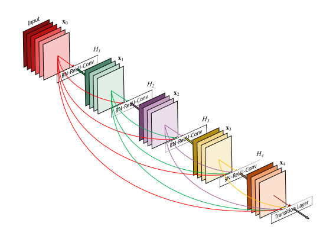
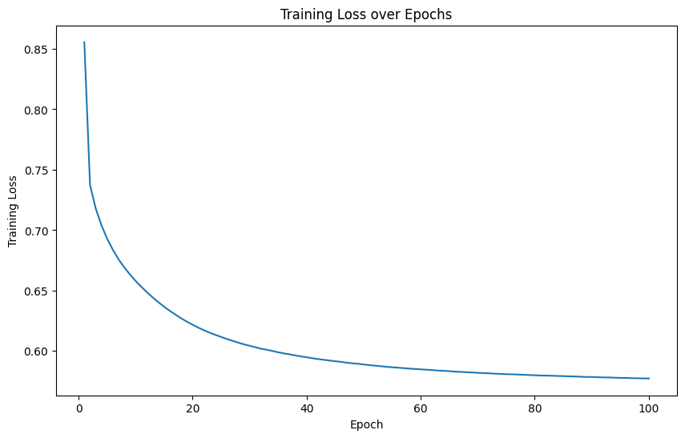
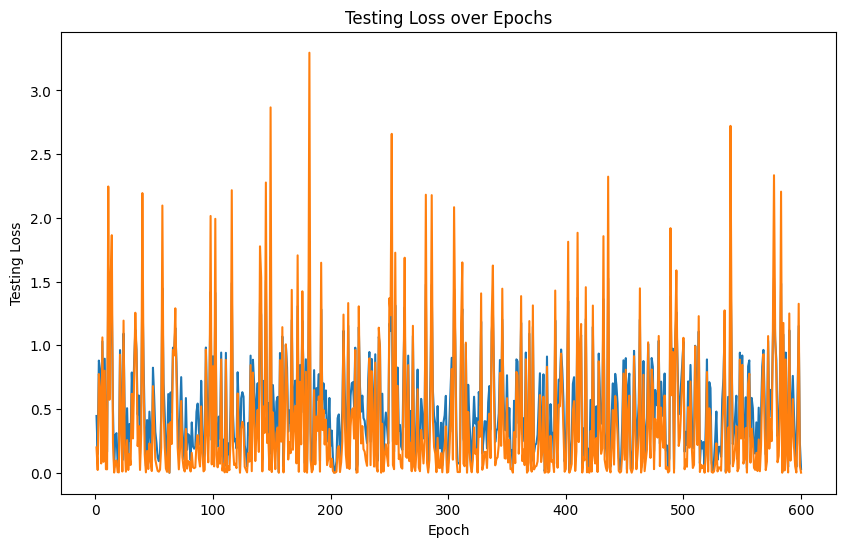

# Multi Task Learning - DenseNet161 Model

## This Folder:

- [Introduction](#introduction)
- [Requirements](#requirements)
- [Installation](#installation)
- [Usage & Demo](#usage--demo)
- [References](#references)

## Introduction:

The MTL model has been successfully implemented, leveraging the benchmarked NITUAVCorridorV1 dataset for training and evaluation. I utilized the pre-trained deep learning model DenseNet161. 

<p align="center">
</img>
</p>

- DenseNet architecture primarily consists of two types: Dense blocks and Transition Layers that handle convolution and pooling operations.
- Within these transition layers, I defined task-specific branches to facilitate task-specific training for the model. 
- This approach allows for efficient utilization of the pre-trained DenseNet model while adapting it to the specific requirements of our project.

## Requirements:

- Torch
- Torchvision
- pandas
- numpy
- matplotlib
- scikit-image
- virtualenv

## Installation:

You can install the <b>NITUAVCorridorV1</b> dataset here: 
```
http://www.nitrkl.ac.in/docs/CS/Database/Windows/NitrUAVCorridorV1.zip
```

Unzip the file and can access the dataset to run this model.

## Usage & Demo:

Firstly try to create a virtual environment for better code base establishment.

```
python -m virtualenv <your_env_name>
```

Once you create, u can use this command to activate it.

```
source <your_env_name>/bin/activate
```

### Demo:

Here are few plots of the model after 100 epochs of training and testing with the 900 evaluation images:

</img>

</img>

</img>

## References:

1) R. P. Padhy, S. Ahmad, S. Verma, S. Bakshi, and P. K. Sa, “Localization of un-
manned aerial vehicles in corridor environments using deep learning,” in 2020
25th International Conference on Pattern Recognition (ICPR), 2021, pp. 9423–
9428

2) Y. Zhang and Q. Yang, “An overview of multi-task learning,” National
Science Review, vol. 5, no. 1, pp. 30–43, 09 2017. [Online]. Available:
https://doi.org/10.1093/nsr/nwx105

3) S. Ruder, “An overview of multi-task learning in deep neural networks,” arXiv
preprint arXiv:1706.05098, 2017

4) Amaarora. (2020, August) Densenets. [Online]. Available: https://amaarora.
github.io/posts/2020-08-02-densenets.html