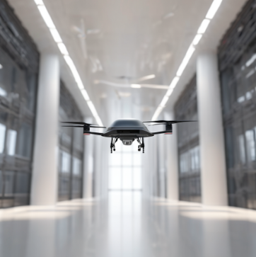

# Localisation of UAVs in Indoor Corridor Environments using Multi Task Learning and Bezier Curve Optimisation

## This Project:

- [Introduction](#introduction)
- [Multi Task Learning](#multi-task-learning)
- [Simulation](#simulation)
- [Contact Me](#contact)
- [Acknowledgements](#acknowledgements)

## Introduction:

This project focuses on the localisation techniques of Unmanned Aerial Vehicles (UAVs) without the use of GPS, which can sometimes be unavailable or unreliable in indoor environments. The main aim is to ensure that the drone moves forward along the given path (waypoints) without any divergence in translation or orientation. We focus on Multi-task learning techniques to work with a single model that can detect the translational and orientational deviation of the UAV, and also implement Bezier Curve Optimisation Techniques to ensure that the given deviation is cancelled out and the UAV has a real-time stabilization throughout the navigation.

## Multi Task Learning:

- The MTNN model has been successfully implemented, leveraging the benchmarked NITUAVCorridorV1 dataset for training and evaluation. 

- For the MTNN model implementation, I utilized the pre-trained deep learning model DenseNet161. 

More about the MTL can be found in the [Models](Models) folder.

## Simulation:

- This project revolves around real-time stabilization of a UAV, implementing and validating the control algorithm in a physical environment presents considerable challenges. 

- Acknowledging these obstacles, the focus shifted towards the development of a simulated environment that closely mimics real-world conditions leveraging tools such as ROS Noetic on Ubuntu 20.04 and Gazebo (Classic) environment.

More about the simulation can be found in the [Simulation](Simulation) folder.

## Acknowledgements:

- I extend my sincerest appreciation to Dr. Ram Prasad Padhy for his invaluable guidance and unwavering support as my project advisor.

- Furthermore, I am thankful for the unwavering support and assistance of my parents and my friends, whose encouragement and collaboration were invaluable throughout this journey.

- I will be keep updating this project for future refrences and also for further developements.

## Contact:

Hi! This is Venkata Madhav, from Computer Science and Engineering Department in IIITDM Kancheepuram, Chennai.

You are reading my final year project on "<i>Localisation of UAVs in Indoor Corridor Environments using Multi Task Learning and Bezier Curve Optimisation</i>"

Feel free me to contact me at cs20b1047@iiitdm.ac.in for any queries or further information.

 
 
 

<b>Thank you!

