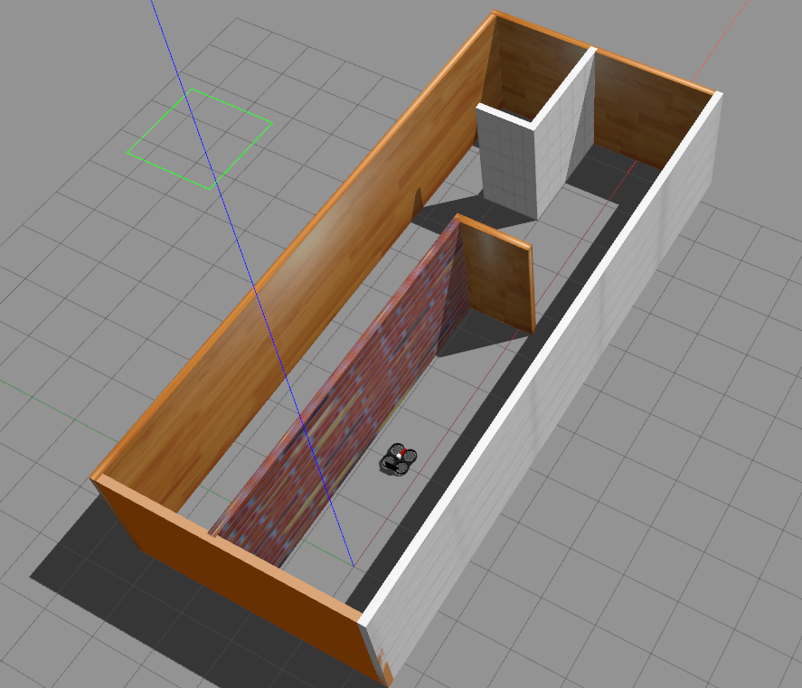
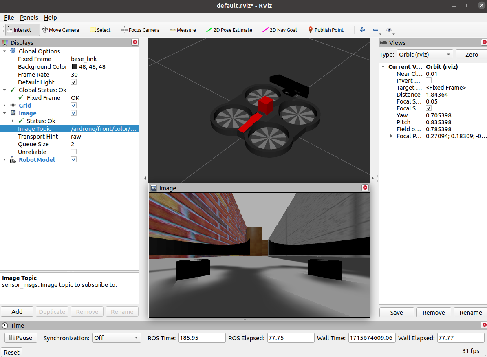

# Gazebo Simulation

## This Folder:

- [Introduction](#introduction)
- [Requirements](#requirements)
- [Installation](#installation)
- [Usage & Demo](#usage--demo)
- [References](#references)

## Introduction:

This simulator features a corridor environment populated by a quadrotor robot sourced from an external project. The quadrotor robot is equipped with a camera sensor capable of providing the necessary image feed for localization purposes.

</img>

## Requirements:

- Ubuntu 20.04
- ROS Noeitic 
- Gazebo Simulator
- Rviz Visualiser

## Installation:

Make sure to install all the requirements to proceed further.

## Usage & Demo:

Once you git clone this repository using:

```
git clone https://github.com/Madhav2133/fyp.git
```

Create a ros worokspace:

```
mkdir -p ~/catkin_ws/src
cd ~/catkin_ws
catkin_make
```

Now you can copy the [SLAM](SLAM) folder into the src folder of the workspace.

```
cp -r Simulation/SLAM ~/catkin_ws/src/
```

Now go to the ros workspace and build the package

```
cd ~/catkin_ws
catkin_make
```

Once you build the package, you are ready the run the simulation.

### Demo:

Make sure to source your terminal before running:
```
source ~/catkin_ws/devel/setup.bash
```

Use the following command to run the simulation:

```
roslaunch demo L1_start_simulation.launch
```

Now in a new terminal (source it first), run the following command:

```
rviz

```
This will open the rviz visualisation tool for accessing the camera feed:

</img>

You can also access the camera feed by accessing the <i>ardrone/front_color/image_raw</i> topic.

## References:

1) Original Simulation for full package: https://github.com/hazemelghamry/SLAM.git (This was written for ROS-Melodic, so I had to change a lot of things for usage, so refer accordingly)

2) C. Bernardeschi, A. Fagiolini, M. Palmieri, G. Scrima, and F. Sofia, “Ros/gazebo
based simulation of co-operative uavs,” in Modelling and Simulation for Au-
tonomous Systems, J. Mazal, Ed. Cham: Springer International Publishing, 2019,
pp. 321–334.

3) N. Nair, K. B. Sareth, R. R. Bhavani, and A. Mohan, “Simulation and stabilization
of a custom-made quadcopter in gazebo using ardupilot and qgroundcontrol,” in
Modeling, Simulation and Optimization, B. Das, R. Patgiri, S. Bandyopadhyay,
and V. E. Balas, Eds. Singapore: Springer Nature Singapore, 2022, pp. 191–202